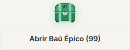
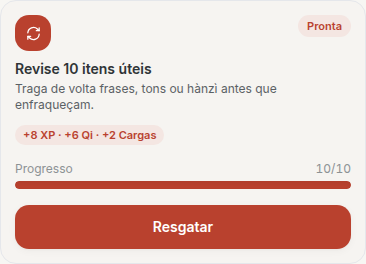
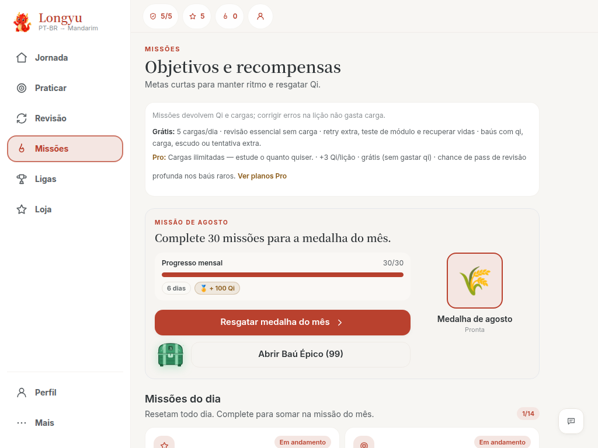

# V4.3 — Tasks / Missions Responsive UI System

Base: `main` `003c45c` (V4.2 já mergeada). Superfície: `/missoes`.

Esta PR **não** altera pedagogia, Journey, Atlas, Mastery nem entitlements — só a gramática visual, conflitos de overlay e o banner de sync (objetivo semântico da #181, reaplicado numa branch nova).

QA físico em Android + desktop ainda é obrigatório antes de declarar o tema encerrado.

---

## Gramática (TASKUI-001)

| Nome | Papel | Implementação |
| --- | --- | --- |
| MissionSurface | página | `HubPage` + `missionUi.surface` + `data-mission-surface` |
| MissionSection | bloco diário/semanal/coleção | `HubSection` + grid `missionUi.grid` |
| MissionCard | card de missão | `Card` + `missionUi.card` + `data-mission-card` |
| MissionProgress | barra + rótulo | `ProgressBar` em `missionUi.progressWrap` |
| MissionReward | pill de recompensa | `missionUi.reward` |
| MissionAction | 1 CTA primário (+ secundário só no hero do baú) | `Button` / `ButtonLink` + `data-mission-cta` |
| MissionStatus | incomplete / progress / complete / claimed / premium | `data-mission-status` + Pill + variant do Card |

Tokens em `src/features/missoes/missionUi.ts`. Não houve uma classe React por nome — a gramática é compartilhada, sem overengineering.

---

## Tokens (TASKUI-002 / 023)

| Token | Valor |
| --- | --- |
| Card radius | `rounded-2xl` (16px) — primitives |
| Card border | `border` + variant (basic / progress / reward / premium) |
| Card padding | `p-3.5` (hero `sm:p-4`) |
| Section gap | `gap-2` |
| Title | `text-sm font-semibold leading-5` |
| Description | `text-xs leading-4` |
| Icon tile | 36×36 `rounded-xl` |
| CTA card | `Button` **sm** (`min-h-11`) |
| CTA hero | `Button` **md** (`min-h-11`) |
| CTA modal | `Button` **lg** (`min-h-12`) |
| Touch | mínimo 44×44 CSS px |
| Card min-height | `--mission-card-min-height: 10.25rem` |
| FAB exclusion | `--app-feedback-fab-gutter: 4.75rem` no `lg+` |

---

## Hierarquia de CTA (TASKUI-003 / 004)

| Estado | Rótulo | Variant | `data-mission-cta` |
| --- | --- | --- | --- |
| incomplete | Praticar | primary | primary |
| progress | Praticar | soft | primary |
| complete | Resgatar | primary | primary |
| premium | Resgatar com Pro | premium | premium |
| claimed | Resgatada | outline disabled | completed |

Hero mensal: no máximo um primário. Se a medalha ainda não foi resgatada, o baú é **outline** (secundário). Depois do resgate, o baú vira primário.

---

## Overlaps encontrados **antes** (análise de código)

1. **Baú mobile** — `w-full` no CTA ao lado do baú + gap. Soma `100% + baú + gap` e estoura a linha. Corrigido com `missionUi.chestRow`: coluna no mobile, `grid-cols-[auto_minmax(0,1fr)]` a partir de `sm`.
2. **EconomySyncBanner** — `fixed` no rodapé (`bottom: nav + 0.5rem`, `z-50`). Visualmente cobria CTA / TabBar. Movido para baixo do header, `pointer-events-none`, timeout 6s, `aria-live="polite"`, não persiste no reload. Claim automático de Pérola **não** dispara mais `"Resgatando Pérola..."`.
3. **Feedback FAB** — `fixed bottom-6 right-6 z-40` a partir de `lg`, sem zona de exclusão. Agora é 44×44, `z-[35]`, e `/missoes` reserva `--app-feedback-fab-gutter`.
4. **Modal de celebração** — ações não usam mais `position: fixed` interno.

Nenhum ajuste foi feito só aumentando z-index.

---

## Camadas (OVERLAP-017)

Fonte: `src/components/ui/layers.ts` e `--z-*` em `src/index.css`.

| Camada | z | Uso |
| --- | --- | --- |
| page | 0 | conteúdo |
| bottomNav | 30 | TabBar |
| feedbackFab | 35 | FAB desktop |
| toast | 40 | banner de sync, burst de claim |
| sheet | 70 | folhas da TabBar |
| modal | 80 | celebração, baú, paywall |

---

## Matriz de CTA (estado do seed rico)

| Card | Status | CTA |
| --- | --- | --- |
| daily-xp | progress | Praticar |
| daily-audio | claimed | Resgatada |
| daily-reviews | complete | Resgatar |
| daily-phrases | incomplete | Praticar |
| daily-pro-fix | premium | Resgatar com Pro |
| weekly-xp | claimed | Resgatada |
| weekly-lessons | progress | Praticar |
| weekly-immersion | complete | Resgatar |
| monthly hero (meta batida) | complete | Resgatar medalha do mês + baú secundário |
| monthly claimed + baú | claimed | medalha resgatada + Abrir Baú Épico (99) primário |

---

## Viewports

E2E: `e2e/missions-responsive.spec.ts` (Chromium = matriz completa; WebKit = 320 / 390 / 1024; Firefox = 390 / 1024).

**Mobile:** 320×568, 360×640, 375×667, 390×844, 393×851, 412×915, 430×932, landscape 667×360, fonte 20px em 375.

**Tablet:** 640×960, 768×1024, 834×1112 (duas colunas, CTAs da fileira alinhados).

**Desktop:** 1024×768, 1180×820, 1280×720, 1366×768, 1440×900, 1920×1080.

Helpers: `assertNoInteractiveOverlap`, `assertNoHorizontalOverflow`, `assertAboveBottomNavigation`, `assertFeedbackFabClear`, `assertTouchTargets`, `assertMissionCardActionsAligned`.

Referências:

---

## Resultados da suíte

`npx playwright test e2e/missions-responsive.spec.ts --project=chromium`

**27 passed** (matriz mobile 7 + tablet 3 + landscape + desktop 6 + estados reais, fonte e safe-area).

| Check | Antes (código) | Depois |
| --- | --- | --- |
| Overlap interactives | baú + CTA na mesma linha mobile | 0 (gate E2E) |
| CTA atrás da TabBar | risco no último card | 0 — `scroll-behavior: auto` + `cta.bottom <= nav.top` no fim da página |
| Overflow horizontal | risco `w-full` + baú | `scrollWidth <= clientWidth + 1` |
| FAB × CTA | possível no `lg` | gutter + FAB 44×44; 1024–1920 verdes |
| Banner × CTA | rodapé persistente | topo, 6s, some no reload |
| Touch 44px | irregular | gate E2E |
| Seed de medalhas | — | `richMissionSeed({ medals: true })` (boolean no extra quebrava a página) |

Referências visuais (artefatos da execução): `missoes-320-hero.png`, `missoes-320-chest-row.png`, `missoes-390-hero.png`, `missoes-1024-hero.png`, `missoes-1280-hero.png`.

---

## Aceite

1. Zero overlap entre botões/links independentes.
2. Zero CTA atrás da bottom nav (depois de rolar).
3. Zero overflow horizontal em `/missoes`.
4. Zero colisão com o FAB de Feedback.
5. EconomySyncBanner não cobre ação e não persiste.
6. 320px e 1024px no E2E.
7. Cards na mesma família visual; CTA semântica única.
8. Nenhum conserto só por z-index.
9. E2E cobre incomplete / progress / complete / claimed / premium, weekly, baú, celebração diária e mensal, paywall, medalhas, tablet, fonte maior e safe-area.
10. QA físico Android + desktop permanece fora desta PR.
